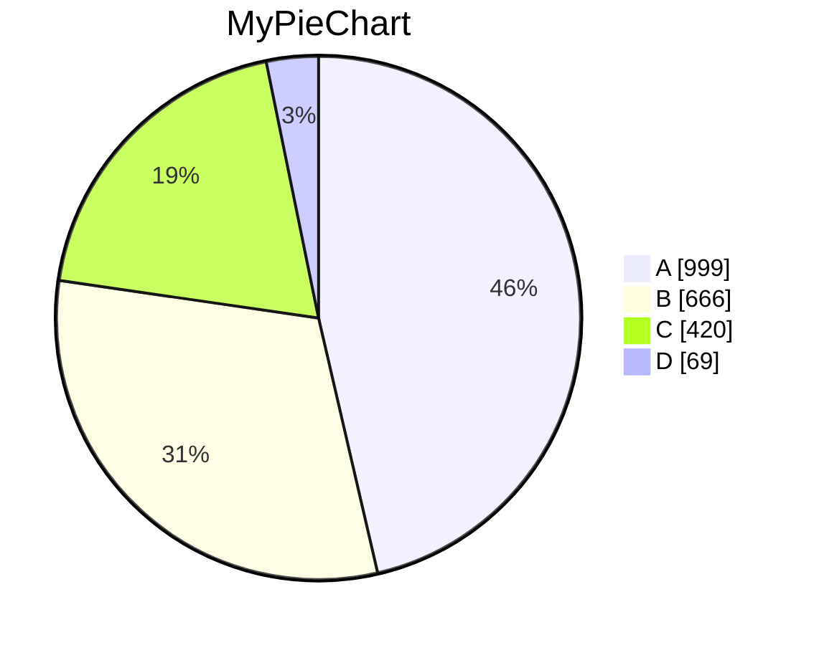

# Frank.Mermaid

This is a Blazor component that builds Mermaid diagrams. It has no rendering, just the just the different building blocks of 
the diagram types supported by Mermaid.

This is not complete yet, but more diagram types will be added as time permits.

## Installation

You can install the package via NuGet. 

```bash
dotnet add package Frank.Mermaid
```

## Usage

Add the following using statement to your _Imports.razor:

```csharp
using Frank.Mermaid;

namespace YourNamespace;

public class Program
{
    public static void Main(string[] args)
    {
        var mermaidPieChart = new PieChart("MyPieChart");
        mermaidPieChart.AddValue("A", 999);
        mermaidPieChart.AddValue("B", 666);
        mermaidPieChart.AddValue("C", 420);
        mermaidPieChart.AddValue("D", 69);
        
        Console.WriteLine(mermaidPieChart.GetBuilder().ToString());
    }
}
```

Raw Mermaid syntax outputted:

```text
pie showData
    title MyPieChart
    "A" : 999
    "B" : 666
    "C" : 420
    "D" : 69
```

Mermaid diagram:


## License

This project is licensed under the MIT License - see the [LICENSE](LICENSE) file for details.

## Credits

This project is 100% original work by Frank R. Haugen. It is not based on any other project or library on purpose. This has 
is not a unique idea, but I need this for a personal project, and existing libraries did not meet my requirements, like 
GitGraph and Timeline was missing, and the existing libraries have in many cases been abandoned or not updated in a long time.