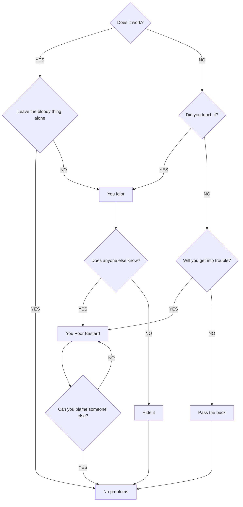
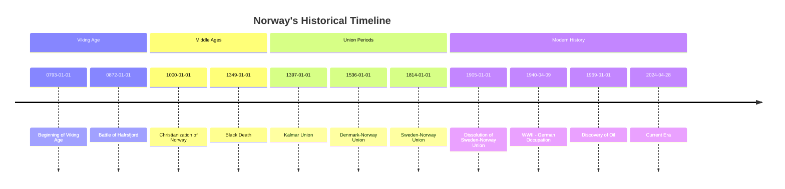
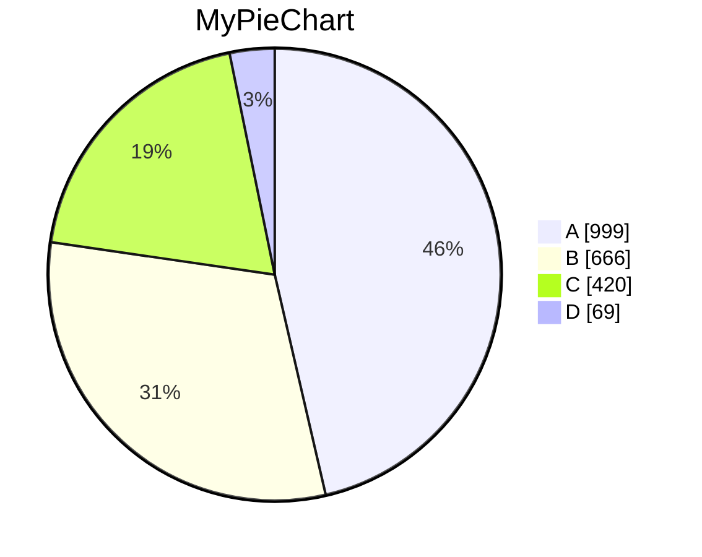

> **Moved to Novolis:** This library is superseded by [`Novolis.Markup.Mermaid`](https://www.nuget.org/packages/Novolis.Markup.Mermaid) from [novolis-markup](https://github.com/Novolis-Platform/novolis-markup). This repository is archived; do not add features here.

# Frank.Mermaid

This is a Blazor component that builds Mermaid diagrams. It has no rendering, just the just the different building blocks of 
the diagram types supported by Mermaid.

This is not complete yet, but more diagram types will be added as time permits.

___
[](LICENSE)
[](https://www.nuget.org/packages/Frank.Mermaid)
[](https://www.nuget.org/packages/Frank.Mermaid)


___

## Installation

You can install the package via NuGet. 

```bash
dotnet add package Frank.Mermaid
```

## Examples

### Flow Chart


```mermaid
flowchart TB
    4UMX1H40C9SM{Does it work?}
    4UMX1H40C8QD{Did you touch it?}
    4UMX1H40C8Y0{Does anyone else know?}
    4UMX1H40C9I5{Will you get into trouble?}
    4UMX1H40C9B9{Can you blame someone else?}
    4UMX1H40CA5I[No problems]
    4UMX1H40CA5O[You Idiot]
    4UMX1H40C8K3[You Poor Bastard]
    4UMX1H40C9UI{Leave the bloody thing alone}
    4UMX1H40C9ZE[Hide it]
    4UMX1H40C929[Pass the buck]
    4UMX1H40C9I5 --->|YES| 4UMX1H40C8K3
    4UMX1H40C9B9 --->|NO| 4UMX1H40C8K3
    4UMX1H40C9B9 --->|YES| 4UMX1H40CA5I
    4UMX1H40C9ZE ---> 4UMX1H40CA5I
    4UMX1H40CA5O ---> 4UMX1H40C8Y0
    4UMX1H40C8Y0 --->|YES| 4UMX1H40C8K3
    4UMX1H40C8Y0 --->|NO| 4UMX1H40C9ZE
    4UMX1H40C9UI --->|YES| 4UMX1H40CA5I
    4UMX1H40C8QD --->|YES| 4UMX1H40CA5O
    4UMX1H40C8QD --->|NO| 4UMX1H40C9I5
    4UMX1H40C9I5 --->|NO| 4UMX1H40C929
    4UMX1H40C9SM --->|YES| 4UMX1H40C9UI
    4UMX1H40C9SM --->|NO| 4UMX1H40C8QD
    4UMX1H40C8K3 ---> 4UMX1H40C9B9
    4UMX1H40C929 ---> 4UMX1H40CA5I
    4UMX1H40C9UI --->|NO| 4UMX1H40CA5O
```

### Timeline


```mermaid

timeline
    title Norway's Historical Timeline
    section Viking Age
        0793-01-01 : Beginning of Viking Age
        0872-01-01 : Battle of Hafrsfjord
    section Middle Ages
        1000-01-01 : Christianization of Norway
        1349-01-01 : Black Death
    section Union Periods
        1397-01-01 : Kalmar Union
        1536-01-01 : Denmark-Norway Union
        1814-01-01 : Sweden-Norway Union
    section Modern History
        1905-01-01 : Dissolution of Sweden-Norway Union
        1940-04-09 : WWII - German Occupation
        1969-01-01 : Discovery of Oil
        2024-04-28 : Current Era
```

### Pie Chart


```mermaid
pie showData
    title MyPieChart
    "A" : 999
    "B" : 666
    "C" : 420
    "D" : 69
```

## License

This project is licensed under the MIT License - see the [LICENSE](LICENSE) file for details.

## Credits

This project is 100% original work by Frank R. Haugen. It is not based on any other project or library on purpose. This has 
is not a unique idea, but I need this for a personal project, and existing libraries did not meet my requirements, like 
GitGraph and Timeline was missing, and the existing libraries have in many cases been abandoned or not updated in a long 
time, at the same time Mermaid is very rapidly developing.

## Contributions

Contributions are welcome. Please read the [CONTRIBUTING](CONTRIBUTING.md) file for more information.

## Support

Please open an issue for any questions or problems. I will do my best to help you.
